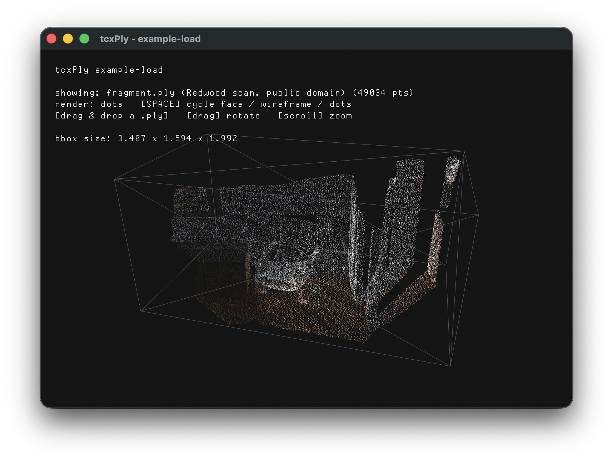

# tcxPly

[](https://github.com/tettou771/tcxPly/actions/workflows/ci.yml)

A TrussC addon for reading and writing PLY (Stanford Polygon File Format) files
as a `tc::Mesh` — meshes and point clouds, ASCII and binary (little/big endian).

```cpp
#include <tcxPly.h>
using namespace tcx;

// Read (one-liner)
Mesh mesh = loadPly("bunny.ply");
mesh.draw();

// Write
savePly("out.ply", mesh);                          // ASCII
savePly("out.ply", mesh, PlyFormat::BinaryLittleEndian);
```

## Features

- **Reading**: `ascii` / `binary_little_endian` / `binary_big_endian`, auto-detected from the header
- **Mesh ↔ point cloud**: a `face` element yields an indexed mesh; without one you get a `PrimitiveMode::Points` cloud
- **Standard attributes → Mesh**: position `x,y,z` / normals `nx,ny,nz` / vertex color `red,green,blue[,alpha]` (uchar 0-255 mapped to 0-1) / texcoords `s,t`, `u,v`, `texture_u,texture_v`
- **Polygon triangulation**: faces with more than 3 vertices are fan-triangulated
- **Non-standard property retention**: per-vertex / per-face scalars like `quality` or `intensity` are kept and fetchable by name
- **Metadata retention**: `format` / `comment` / `obj_info` are preserved and restored across `load` → `save`
- **Writing**: `ascii` and `binary_little_endian` (selectable via `PlyFormat`)

## API

The free functions `loadPly` / `savePly` are for the "I just want a Mesh" case.
Use the `Ply` class when you want metadata or extra property columns.

```cpp
Ply ply;
ply.load("scan.ply");

Mesh mesh      = ply.toMesh();
BoundingBox bb = ply.getBoundingBox();   // bb.center(), bb.size()

// Properties are fetched "typed": if the template type does not match the
// PLY type, you get an empty vector (no conversion). Standard and custom
// properties are accessed the same way.
auto crv = ply.getVertexProperty<float>("curvature");    // a float property
auto red = ply.getVertexProperty<uint8_t>("red");        // a uchar property
// List the properties a file holds (name + type)
for (auto& p : ply.getVertexProperties())
    logNotice() << p.name << " : " << plyTypeName(p.type);

for (auto& c : ply.getComments())  logNotice() << c;
for (auto& o : ply.getObjInfo())   logNotice() << o;

// Write from a Mesh (metadata can be attached too)
Ply out;
out.setMesh(mesh);
out.addComment("exported from MyApp");
out.save("out.ply", PlyFormat::BinaryLittleEndian);
```

Main methods:

| Method | Description |
|---|---|
| `load(path)` / `save(path, format)` | Read / write (`path` resolved via `getDataPath`; absolute paths used as-is) |
| `toMesh()` / `setMesh(mesh)` | Convert to / from `tc::Mesh` |
| `getVertexProperty<T>(name)` / `getFaceProperty<T>(name)` | Fetch a scalar column **typed** (empty if `T` doesn't match, no conversion; `T` defaults to `float`) |
| `getVertexProperties()` / `getFaceProperties()` | List of properties (`PlyPropertyInfo{name, type, isList}`) |
| `getComments()` / `getObjInfo()` / `addComment()` / `addObjInfo()` | File metadata |
| `getFormat()` / `setFormat()` | Format |
| `getBoundingBox()` | Vertex AABB (`BoundingBox{min, max, center(), size()}`) |
| `getNumVertices()` / `getNumFaces()` | Counts |

## Examples

```bash
cd addons/tcxPly/example-load     # display a colored point cloud, drag & drop .ply
trusscli update
trusscli run

cd ../example-save                # generate a Mesh → save → reload → display
trusscli update
trusscli run
```

On startup `example-load` shows **fragment.ply** — the RGB-colored point cloud
from the Redwood "Living Room" indoor scan (public domain). The bundled copy is
a derivative produced by tcxPly's own `save()`: downsampled to 1/4 and flipped
upright, keeping every property (including `curvature` and the `camera` element).
**Drag and drop** any `.ply` onto the window to load it (with color recovery
from a Gaussian Splat's `f_dc_*` terms). When a mesh is dropped, `[SPACE]`
cycles **face → wireframe → dots**. See [LICENSES.md](LICENSES.md) for the
bundled-data licenses.



## Limitations

- Writing supports only ASCII and little-endian binary (big-endian is read-only)
- `toMesh()` only interprets the `vertex` / `face` elements. Custom elements
  (`edge`, camera, ...) are reachable as raw data via `getElements()` but are not
  reflected into the Mesh
- Values are stored internally as `double`, so 64-bit integer properties
  (`int64` / `uint64`) are not supported

## License

MIT — see [LICENSES.md](LICENSES.md).
